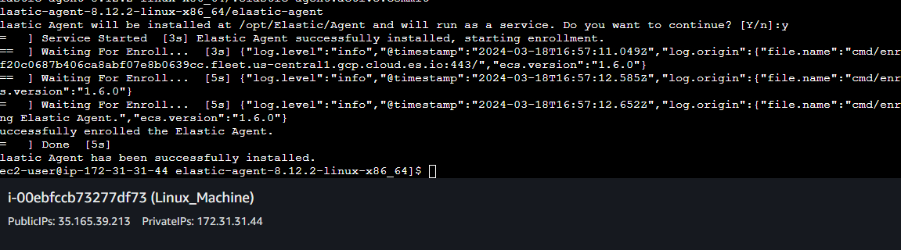
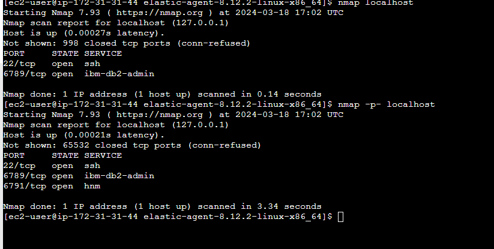
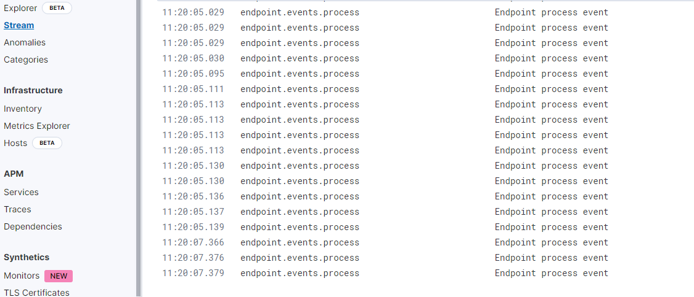
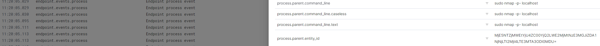
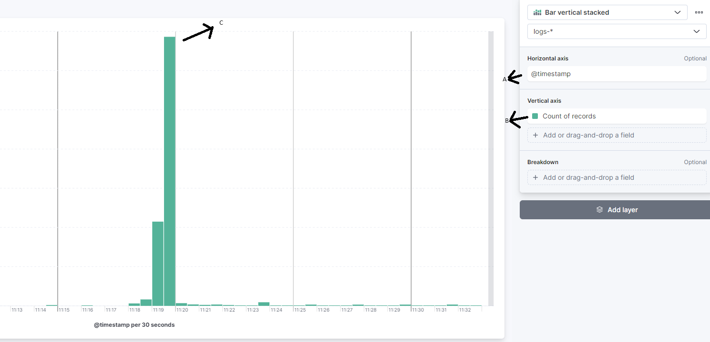
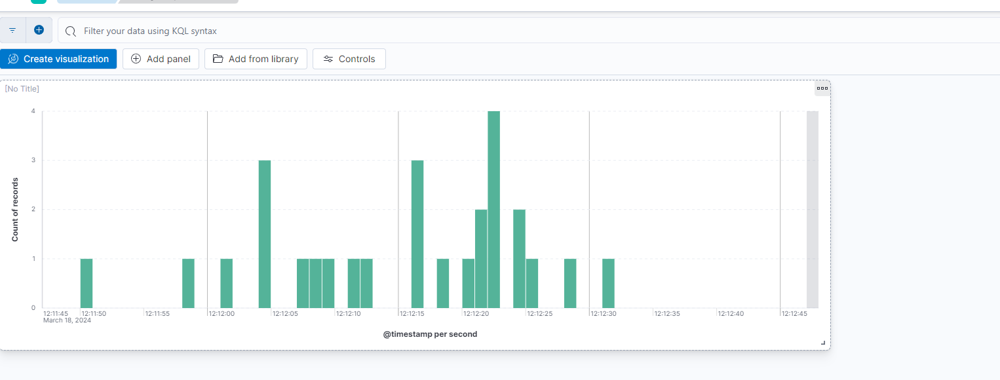
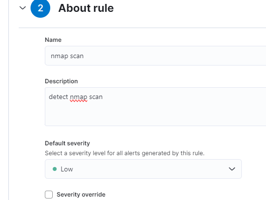
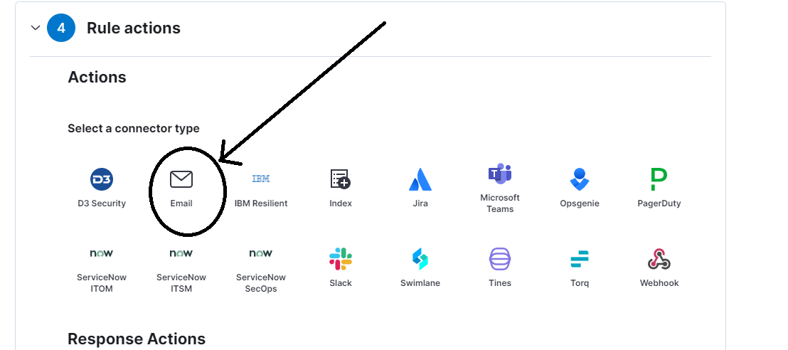

<h1>Elastic SIEM</h1>

 ### [YouTube Demonstration](https://youtu.be/7eJexJVCqJo)

<h2>Description</h2>
A lab employing Elastic SIEM for log aggregation from Linux Fedora instances hosted on Amazon Web Services. These logs are leveraged to construct dashboards facilitating the real-time monitoring of nmap scans conducted on the machines, triggering alerts upon each scan occurrence.
<br />


<h2>Languages and Utilities Used</h2>

- <b>ElasticSearch SIEM</b> 
- <b>Amazon Web Services</b>

<a href="https://www.elastic.co/">ElasticSearch </a>

- <b>AWS Fedora</b> 

<h2>Program walk-through:</h2>

<p align="center">
1.	Obtain elastic agent and add to Fedora host. Integration> elastic defence> add integration <br/>

<br />
<br />
2.	Push and install agent on Amazon linux Fedora VM using curl command below:  <br/>

<br />
<br />
3. Elastic agent installed successfully on Fedora VM <br/>

<br />
<br />
4. Generate logs by peforming 2 nmap scans. "sudo nmap localhost" & "sudo nmap -p- localhost:  <br/>

<br />
<br />
5. Logs generated by nmap commands on fedora host <br/>

<br />
<br />
6. Detail of scan  <br/>

<br />
<br />
7. Dashboard visusalisation  <br/> 
 <br>A - Horizontal axis (Time stamp) and Vertical axis (counts)</br>

</p>
8. More nmap logs generated  <br/>

</p>
9. Create rule for alert:  <br/>

</p>
10. Select email alert to designated administrator:  <br/>

</p>

<!--
 ```diff
- text in red
+ text in green
! text in orange
# text in gray
@@ text in purple (and bold)@@
```
--!>
